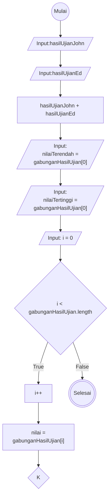

```mermaid
flowchart TD
A@{ shape: circle, label: "Mulai" }
B@{ shape: lean-r, label: "Input:hasilUjianJohn" }
C@{ shape: lean-r, label: "Input:hasilUjianEd" }
D@{ shape: rect, label: "hasilUjianJohn + hasilUjianEd" }
E@{ shape: lean-r, label: "Input:
nilaiTerendah =
 gabunganHasilUjian[0]" }
F@{ shape: lean-r, label: "Input:
nilaiTertinggi =
 gabunganHasilUjian[0]" }
G@{ shape: lean-r, label: "Input: i = 0" }
H@{ shape: diamond, label: "i < gabunganHasilUjian.length" }
I@{ shape: rect, label: "i++" }
J@{ shape: rect, label: "nilai = 
gabunganHasilUjian[i]" }


K@{ shape: diamond, label: "" }

End@{ shape: dbl-circ, label: "Selesai" }


A --> B --> C --> D -->E -->F --> G --> H
H -- True --> I
I --> J --> K
H -- False --> End
```